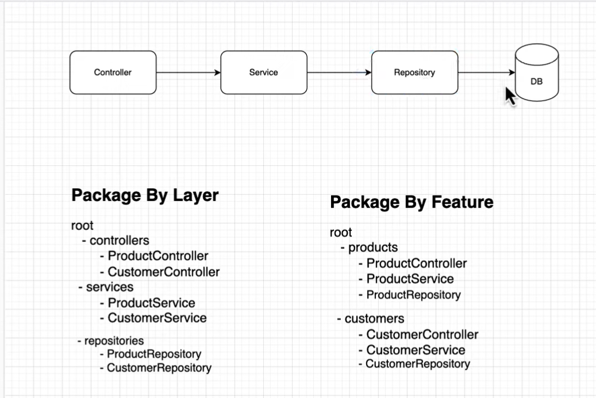
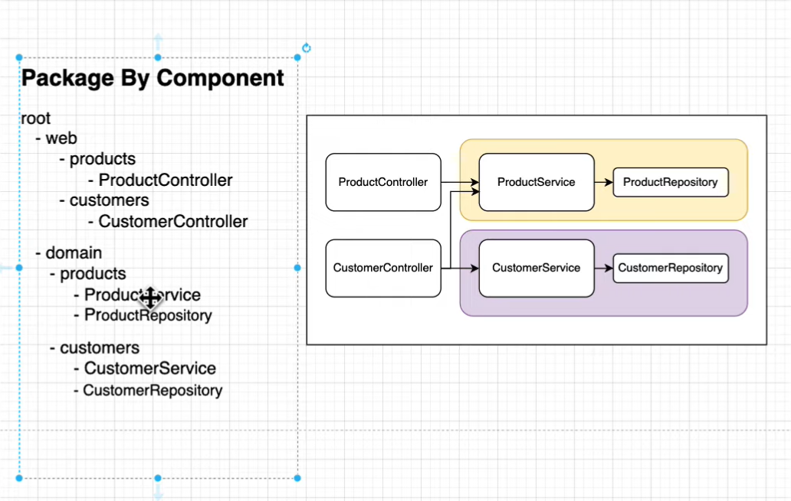
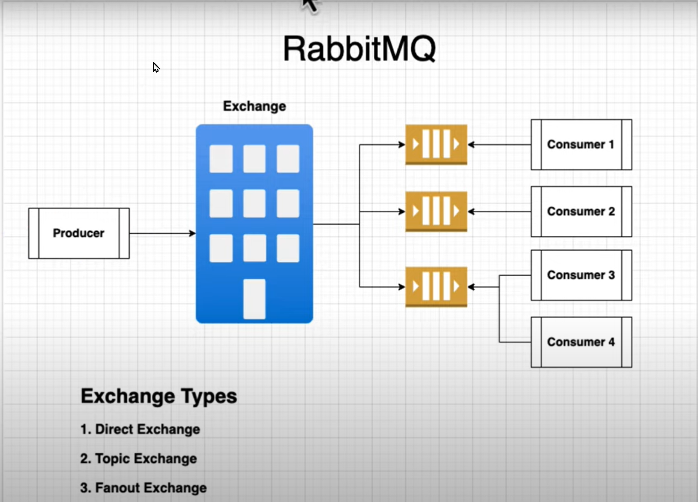
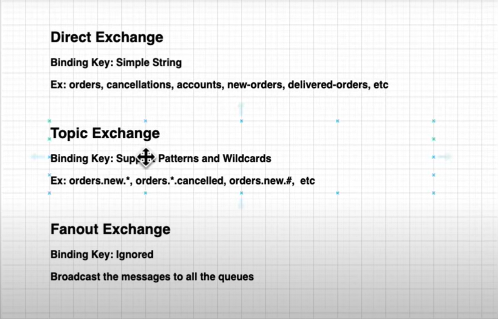

# microservices-project
This project contains couple of micro-services and intercommunication between them. I have referred Siva Labs youtube channel for this project 

- http://localhost:8081/swagger-ui.html#/
- http://localhost:8081/actuator

# packing structure 






## Useful URLS

- https://docs.spring.io/spring-boot/maven-plugin/build-info.html
- https://springdoc.org/


## Coding practices

- dont Expose your entities to front end
- make due only services and its methods are public otherwise give least privilege to other members and classes
- collection based response use pagination
- while writing test cases for rest assured make sure data in DB is in known state
- maven plugin to create docker image
- to build image

## New Concepts Learned out of this project

- ProblemDetail in Exception handler
- Add Generic Exception in Global exception Handler 
- Default Values for RequestParam
- Flyway set up
- default Values to properties  :: spring.datasource.url=${DB_URL:jdbc:postgresql://localhost:15432/postgres}
- `server.shutdown=graceful`
- use of record
- exception for certain code
- recompile when using dev tools so that you dont need to build again 
- instantio
## Useful Commands 

````cmd
./mvnw -pl catalog-service spring-boot:build-image -DskipTests 

docker compose -f infra.yml -f apps.yml up -d

http://localhost:15672/ => for RabbitMQ dashboard
````


