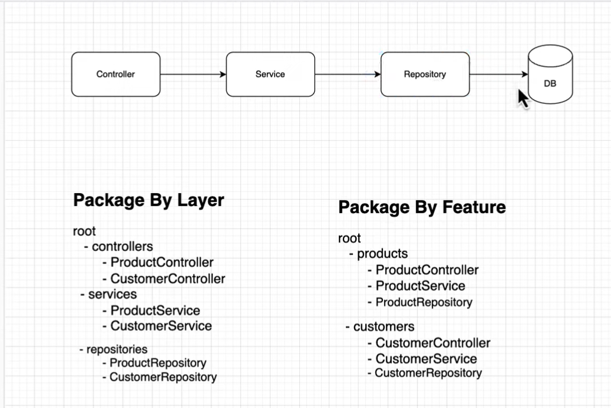
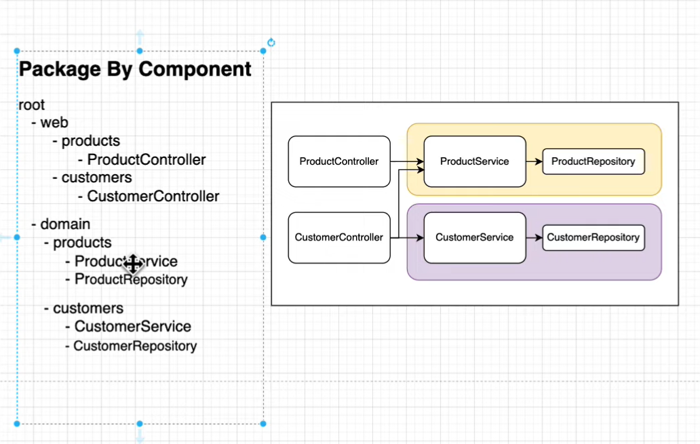

# microservices-project
This project contains couple of micro-services and intercommunication between them. I have referred Siva Labs youtube channel for this project 

- http://localhost:8081/swagger-ui.html#/
- http://localhost:8081/actuator

# packing structure 

## Useful URLS

- https://docs.spring.io/spring-boot/maven-plugin/build-info.html
- https://springdoc.org/

## Coding practices

- dont Expose your entities to front end
- make due only services and its methods are public otherwise give least privilege to other members and classes
- collection based response use pagination
- 